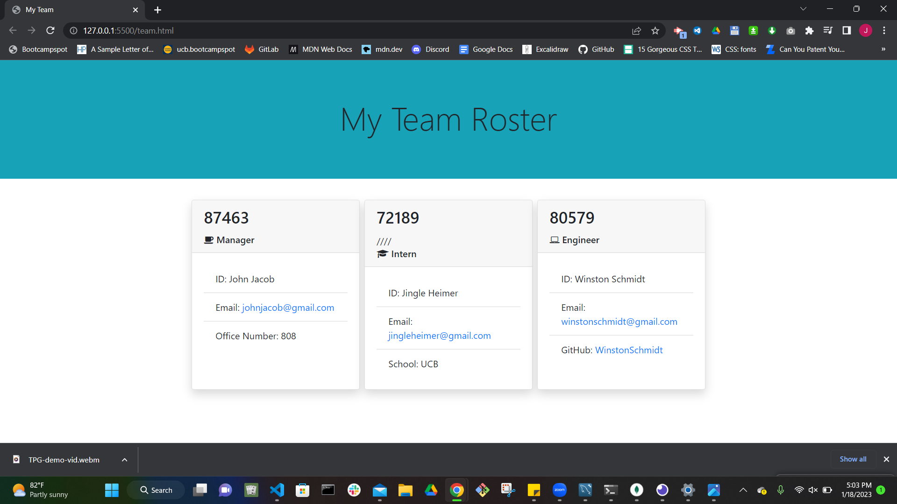

# Team_Profile_Generator

# Description

This command-line application uses Node.js to take in user input to generate an HTML 'team profile' webpage. The user is prompted with questions in the terminal about employees on a software engineering team, and then the HTML webpage displays those profile summaries for each person on the page. The profiles will display email addresses and a GitHub username that when clicked, directs the user to the default email program and GitHub profile in a new tab. 

## Table of Contents 
* [Technologies Used](#technologies-used)
* [Installation](#installation)
* [Usage](#usage)
* [Tests](#tests)
* [Screenshots](#screenshots)
* [Demo](#demo)
* [Links](#links)
* [Contributors](#contributors)

## Technologies Used

- Node.js
- JavaScript
- CSS
- File system module (fs)

dev-dependencies: 
- Jest

dependencies: 
- Inquirer

## Installation

npm install, npm i inquirer, npm install --save-dev jest

## Usage 

- While in the main project folder, enter "node index.js" in the command line of your terminal
- The user will be asked a series of questions about their team. After answering all the questions, an HTML file will be created from the answers. 

## Tests

1. Run tests
    - To test that all core functions are working properly, enter "npm run test" in the command line of your terminal 
2. Create or update classes to pass a single test case
3. Repeat

## Screenshots

## Demo 

## Links 

GitHub repository URL: https://github.com/JacquelineHockin/Team_Profile_Generator

## Contributors 
- Jacqueline Cashman
- [GitHub: JacquelineHockin](https://github.com/jacquelinehockin)